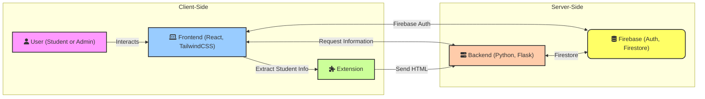

# Irshadi platform
Irshadi platform is a web application that gathers students' historical data in an easy and convenient way for the students, the data gathered will be useful in implementing many features and functions through the program, such as personalizing students' experience. We will also gather student course selections for upcoming semesters. Our program will make use of the information gathered to provide insights to faculty members to help them plan courses sections effectively to match students demands, through detailed reports and recommendations.

# System Architecture

# Made By

- Hamza Zain Sebaih 

- Abdulaziz Saddig Jastanieh 

- Waleed Awwadh Alsafari 
